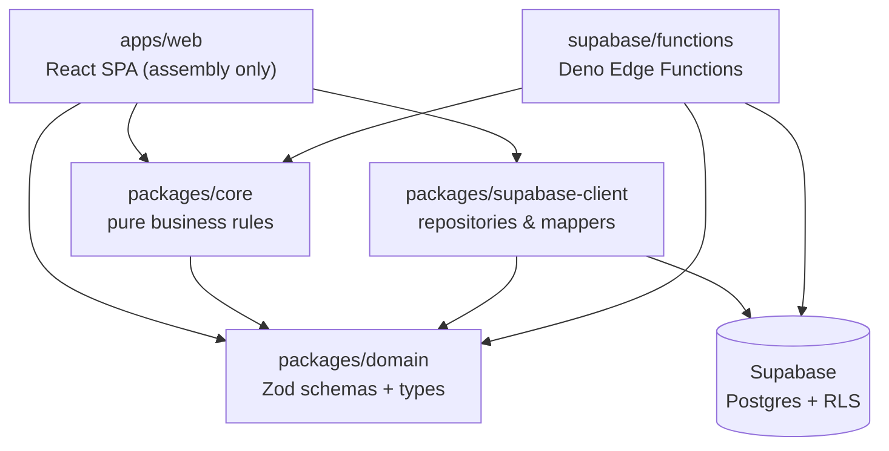

# Sorento

**A calm, collaborative companion for the weeks after a bereavement.**

Sorento is a French web application that turns the administrative maze following a death into a personalised journey: the right procedures in the right order, benefits that may apply, and letter templates ready to review. Everything is driven by a deterministic, conditional rules engine (no AI, no guesswork) inside a **dossier**, a space relatives share and move through together.

<!-- sync-docs:badges -->

[](https://github.com/sylwaninn/sorento-monorepo/actions/workflows/ci.yml)


<!-- /sync-docs:badges -->

> Sorento informs, it never advises. Entitlements are always presented as possibilities ("people in a situation like yours _may_ be entitled to…"), every screen touching inheritance refers to regulated professionals (notaire, lawyer), and generated letters are templates the user reviews and signs. See [Domain rules](#domain-rules).

## Table of contents

- [How it works](#how-it-works)
- [Architecture](#architecture)
- [Repository layout](#repository-layout)
- [Getting started](#getting-started)
- [Commands](#commands)
- [Environment variables](#environment-variables)
- [Testing](#testing)
- [Supabase](#supabase)
- [Quality gates](#quality-gates)
- [Documentation](#documentation)
- [Security](#security)
- [Domain rules](#domain-rules)
- [Contributing](#contributing)
- [License](#license)

## How it works

- **The dossier** is the central entity: a collaborative space for one bereavement, with two states: `PREPARATION` (set up in advance, invisible to the trusted contact) and `ACTIVE` (the journey is live).
- **Roles**: `owner`, `collaborator`, `viewer`, `trusted_contact`. The trusted contact sees nothing until activation; activation they request goes through a 48 h grace period during which every member is notified and may object.
- **The rules engine** (`packages/core`) evaluates the answers collected in the dossier and produces the journey: procedures, deadlines, possible benefits, letter templates. It is pure, clocked by injection, and fully unit- and mutation-tested.
- **Authorization lives in the database**: every table has RLS enabled with explicit policies; the UI hides, RLS forbids. The full model is in [SECURITY.md](SECURITY.md).

Web only, by design. A mobile app may come later: the packages stay reusable, but no mobile code lives here.

## Architecture



<!-- sync-docs:packages -->

| Package                    | Path                       | Role                                                                                                    |
| -------------------------- | -------------------------- | ------------------------------------------------------------------------------------------------------- |
| `@sorento/web`             | `apps/web`                 | React SPA, the assembly layer. Composes the packages into screens; contains no business rule.           |
| `@sorento/e2e`             | `e2e`                      | Playwright end-to-end journeys against the real local stack (built app, real RLS, real Edge Functions). |
| `@sorento/config`          | `packages/config`          | Shared tooling presets: ESLint (including import boundaries), TypeScript, Prettier, Vitest coverage.    |
| `@sorento/core`            | `packages/core`            | Pure business rules (journey engine, permissions, deadlines). No React, no I/O, injected clock.         |
| `@sorento/domain`          | `packages/domain`          | Zod schemas and the types inferred from them: the single source of truth for domain shapes.             |
| `@sorento/supabase-client` | `packages/supabase-client` | Repositories and row-to-domain mappers. The only package allowed to import `@supabase/supabase-js`.     |

<!-- /sync-docs:packages -->

The arrows above are not documentation, they are law: `eslint-plugin-boundaries` (configured in `packages/config`) fails the build on any import that crosses them. The non-negotiables:

- `packages/core` is pure: zero React, zero Supabase, zero I/O, injected clock. Every business rule lives here, with its unit tests.
- `packages/domain` is the single source of truth for types: Zod schemas, `z.infer`, never hand-duplicated interfaces.
- `packages/supabase-client` is the only package that may import `@supabase/supabase-js`.
- `apps/web` assembles. A React component never contains a business rule.
- No package may import from `apps/*`.

## Repository layout

```
sorento-monorepo/
├── apps/
│   └── web/                  # React SPA (assembly layer)
├── packages/
│   ├── core/                 # Pure business rules
│   ├── domain/               # Zod schemas + inferred types
│   ├── supabase-client/      # Repositories & mappers (sole supabase-js importer)
│   └── config/               # Shared tooling presets (ESLint, TS, Prettier, Vitest)
├── e2e/                      # Playwright end-to-end journeys
├── supabase/
│   ├── migrations/           # Versioned SQL; RLS policies ship with their tables
│   ├── functions/            # Deno Edge Functions
│   └── seed.sql              # Local seed data
├── scripts/                  # Repo automation (import map, test audit, docs sync)
└── .github/workflows/ci.yml  # Quality gates
```

Each workspace has its own README with the details that matter locally.

## Getting started

### Prerequisites

- **Node.js ≥ 20** and **pnpm** (pinned via `packageManager`; `corepack enable` is the easiest route)
- **Deno 2**: lint, typecheck and tests for the Edge Functions
- **Docker** and the **[Supabase CLI](https://supabase.com/docs/guides/cli)**: local Postgres, Auth, Storage and Edge runtime
- **gitleaks** (`brew install gitleaks`): required by the pre-commit hook

### Setup

```bash
pnpm install                # installs the workspace + husky hooks
cp .env.example .env        # then fill in the values
supabase start              # local stack (Postgres, Auth, Storage, Edge runtime)
supabase db reset           # replays every migration + seed.sql
pnpm dev                    # Vite dev server for apps/web
```

The app is available on the Vite dev URL; Supabase Studio on the URL `supabase start` prints.

## Commands

All commands run from the repository root.

<!-- sync-docs:commands -->

| Command                       | What it does                                                                         |
| ----------------------------- | ------------------------------------------------------------------------------------ |
| `pnpm dev`                    | Start every dev server (Vite for `apps/web`) through Turborepo.                      |
| `pnpm build`                  | Build all packages and the web app.                                                  |
| `pnpm lint`                   | ESLint across the workspace, import boundaries included.                             |
| `pnpm typecheck`              | TypeScript checks across the workspace.                                              |
| `pnpm test`                   | Unit tests (Vitest) across the workspace.                                            |
| `pnpm test:integration`       | Integration tests (RLS, hardening, Edge Functions) against the local Supabase stack. |
| `pnpm sync:functions-imports` | Regenerate the Deno import map for the Edge Functions.                               |
| `pnpm sync:docs`              | Regenerate this README's generated blocks.                                           |
| `pnpm check:docs`             | Fail if this README's generated blocks are stale (CI and hooks run this).            |
| `pnpm check:functions`        | Verify the Deno import map, then lint and typecheck every Edge Function.             |
| `pnpm test:functions`         | Deno tests for the Edge Functions' shared modules.                                   |
| `pnpm check:tests`            | Structural test audit: every rule module has a test, every test has a subject.       |
| `pnpm format`                 | Prettier, write mode.                                                                |
| `pnpm format:check`           | Prettier, check mode.                                                                |
| `pnpm prepare`                | Husky bootstrap; runs automatically on install.                                      |
| `pnpm test:coverage`          | Unit tests with per-package coverage thresholds.                                     |
| `pnpm test:e2e`               | Playwright end-to-end journeys (needs the local stack and a production build).       |
| `pnpm coverage:diff`          | Coverage of the lines the current branch changed, from the existing lcov reports.    |
| `pnpm coverage:ratchet`       | Raise each package's coverage thresholds to what it actually achieves.               |
| `pnpm coverage:ratchet:check` | Fail when coverage thresholds have too much slack under them.                        |
| `pnpm verify`                 | The full local quality gate: the same bar CI enforces.                               |
| `pnpm test:mutation`          | Stryker mutation testing on `core` and `domain`.                                     |

<!-- /sync-docs:commands -->

## Environment variables

`.env.example` documents every variable; the table below is generated from it. Only `VITE_`-prefixed variables ever reach the browser.

<!-- sync-docs:env -->

| Variable                    | Scope  | Description                                                                                                     |
| --------------------------- | ------ | --------------------------------------------------------------------------------------------------------------- |
| `VITE_SUPABASE_URL`         | Client | Supabase project URL, exposed to the browser.                                                                   |
| `VITE_SUPABASE_ANON_KEY`    | Client | Supabase anonymous key. Safe client-side: RLS does the guarding.                                                |
| `SUPABASE_SERVICE_ROLE_KEY` | Server | Bypasses RLS. Edge Functions and server-side scripts only: never client-side, never committed.                  |
| `SUPABASE_DB_URL`           | Server | Direct Postgres connection, used by the integration tests.                                                      |
| `RESEND_API_KEY`            | Server | Transactional email provider key.                                                                               |
| `RESEND_FROM_EMAIL`         | Server | Sender address for transactional emails.                                                                        |
| `SITE_URL`                  | Server | Base URL the Edge Functions use to build links (invitations, activation).                                       |
| `CRON_SECRET`               | Server | Shared secret protecting the cron-invoked functions; mirrored in Vault (`cron_secret`).                         |
| `SUPPORT_EMAIL`             | Server | Recipient of activation objections. Unset, the function logs a warning instead of pretending it warned someone. |
| `APP_ENV`                   | Server | `development` unlocks the dev-only endpoints. Absent in staging and production: door closed.                    |
| `TURNSTILE_SITE_KEY`        | Client | Captcha (hook planned, not enabled in V1).                                                                      |
| `TURNSTILE_SECRET_KEY`      | Server | Captcha (hook planned, not enabled in V1).                                                                      |

<!-- /sync-docs:env -->

The `service_role` key bypasses RLS: Edge Functions and server-side scripts only, never client-side, never in a file git does not ignore. Development-only endpoints are guarded server-side by `env.isDevelopment` and answer 404 anywhere else: a client-side guard alone is never enough.

## Testing

The suites are layered so that each one catches what the previous one cannot:

| Layer            | What it catches                                                             | Command                               |
| ---------------- | --------------------------------------------------------------------------- | ------------------------------------- |
| Structural audit | A rule module shipped without a test; a test whose subject no longer exists | `pnpm check:tests`                    |
| Unit + coverage  | Business rules, schemas, mappers; thresholds enforced per package           | `pnpm test:coverage`                  |
| Mutation         | Assertions that would not notice the code changing (`core`, `domain`)       | `pnpm test:mutation`                  |
| Integration      | RLS policies, hardening, Edge Functions against a real local Postgres       | `pnpm test:integration`               |
| Edge Functions   | The Deno-side shared modules                                                | `pnpm test:functions`                 |
| End-to-end       | A screen, a policy and a function disagreeing about what a user may do      | `pnpm --filter @sorento/e2e test:e2e` |

Integration and E2E suites need the local stack up (`supabase start`). Every new business rule arrives with its unit tests; every new RLS policy arrives with its integration test. The full strategy, and what each layer deliberately does not cover, is in [TESTING.md](TESTING.md).

## Supabase

- **Migrations only.** The schema changes exclusively through versioned SQL in `supabase/migrations/`, never through the dashboard. RLS is enabled and its policies written in the same migration that creates a table.
- **Edge Functions** run on Deno and share `@sorento/domain` and `@sorento/core` through a generated import map (`pnpm sync:functions-imports`). Cron-invoked functions are protected by `CRON_SECRET` (mirrored in Vault).

<!-- sync-docs:functions -->

| Function                             | Purpose                                                                                                           |
| ------------------------------------ | ----------------------------------------------------------------------------------------------------------------- |
| `accept-invitation`                  | Accepts a dossier invitation and creates the membership.                                                          |
| `consent-trusted-contact`            | Records the trusted contact's consent and issues their long-lived activation link.                                |
| `daily-reminders`                    | Cron: computes and queues the daily reminder notifications.                                                       |
| `designate-trusted-contact`          | Designates a trusted contact and sends the consent link.                                                          |
| `dev-signup`                         | Development only (`env.isDevelopment`): account creation without a confirmation email. Answers 404 anywhere else. |
| `invite-member`                      | Sends a dossier invitation email.                                                                                 |
| `oppose-dossier-activation`          | Registers a member's objection during the 48 h activation grace period.                                           |
| `process-dossier-activations`        | Cron: activates dossiers whose 48 h grace period expired without objection.                                       |
| `request-dossier-activation`         | Lets the trusted contact request activation: starts the 48 h grace period and notifies every member.              |
| `resolve-invitation`                 | Public: resolves an invitation token to who invites to which dossier, and nothing more.                           |
| `resolve-trusted-contact-activation` | Public: resolves an activation token so the trusted contact sees what is about to happen.                         |
| `send-pending-emails`                | Cron: delivers the queued notification emails.                                                                    |
| `weekly-digest`                      | Cron: queues the opt-in weekly progress summary (what advanced, never what is late).                              |

<!-- /sync-docs:functions -->

`_shared/` holds the code every function runs first (env guard, auth, schemas) and is covered by `pnpm test:functions`.

## Quality gates

The same bar is enforced three times, closest gate first:

1. **Pre-commit** (husky): gitleaks secret scan, `lint-staged` (ESLint + Prettier), `pnpm typecheck`. `--no-verify` is not used, ever.
2. **`pnpm verify`**: format check, lint, typecheck, Edge Function checks, docs freshness, unit tests with coverage thresholds: the full local gate.
3. **CI** (`.github/workflows/ci.yml`), on every PR and push to `main`:

| Job         | What it runs                                                 |
| ----------- | ------------------------------------------------------------ |
| Quality     | Prettier, ESLint, TypeScript, Deno checks, docs freshness    |
| Test        | Unit tests with per-package coverage thresholds              |
| Mutation    | Stryker on `core` and `domain`, per-package score thresholds |
| Build       | Full workspace build                                         |
| Secret scan | gitleaks over the commits the PR adds                        |

## Documentation

This README does not rot by accident:

- The blocks between `<!-- sync-docs:* -->` markers (badges, packages, commands, Edge Functions, env vars) are **generated** by `pnpm sync:docs` from the manifests, the workspace layout, `supabase/functions/` and `.env.example`. Never edit them by hand.
- `pnpm check:docs` fails when they are stale: it runs in `pnpm verify`, in the CI Quality job, and in a Claude Code Stop hook, so a change that adds a script, a package, a function or an env var cannot land without its documentation.
- Adding one of those without a description fails the same check until a one-line description is added in `scripts/sync-docs.mjs`.
- Prose sections (this file's and each workspace README's) are updated by hand in the same PR as the change that makes them stale.

## Security

The full model (authorization, activity log, activation grace period, admin boundaries) is in [SECURITY.md](SECURITY.md). The headlines:

- RLS on every table; a table without a policy is unreachable, and that is the intended default.
- The platform admin has no access to users' dossiers, tracking, comments or documents: only aggregate counters.
- The trusted contact sees nothing while the dossier is in `PREPARATION`; activation goes through a 48 h grace period with every member notified.
- When a member is removed, their assignments revert to unassigned (never an orphan reference) and the event is logged.
- Deletions are soft, with a 30-day bin. Comments are soft-deleted with a visible trace.

## Domain rules

The product context (bereavement) sets rules the code enforces:

- Cautious wording about entitlements, always: possibilities, never promises.
- Systematic referral to regulated professionals on every inheritance-related screen; the app never produces individual legal advice or a legal instrument.
- Generated letters are templates for the user to review and sign.
- Catalog data is displayed with its `source_url`, `last_verified_date` and `caution_text`, non-optional by type.
- The UI is never guilt-inducing: no aggressive red on overdue items, no overdue counter, at most 2-3 highlighted "to do now" items.
- Emails are sober, never put the deceased's name in the subject, and carry one-click unsubscribe.

All code, documentation and SQL are in English; only user-facing copy and catalog data are in French.

## Contributing

- Branches: `feat/…`, `fix/…`, `chore/…`, `hotfix/…`.
- Commits: conventional, one line, `type(scope): description` (e.g. `feat(web): add PIN verification flow`). Scoped commits, one logical unit each.
- Before marking anything done: `pnpm verify` passes.
- PRs follow [the template](.github/pull_request_template.md); the `create-pr` skill in `.claude/` automates the whole flow, documentation check included.
- Torn between two approaches? Pick the simplest one that respects [CLAUDE.md](CLAUDE.md), and record the choice in a short comment.

## License

Proprietary. © 2026 Sorento. All rights reserved. No license is granted for use, copying or redistribution.
